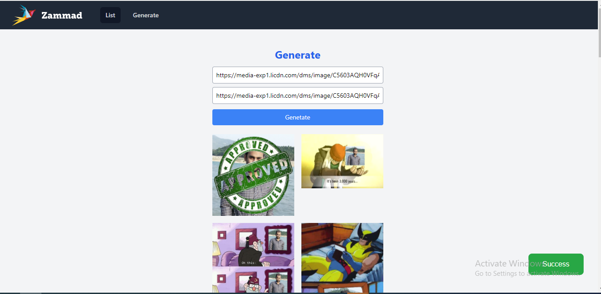
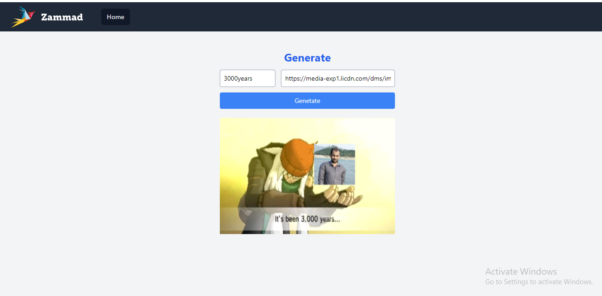

# Frontend Coding Challenge

Clone this repo, run `npm install` and start the project using `npm run dev`.
The instructions for completing the task can be found in the site that will launch.

## Additional Hints

### Recommended IDE Setup

- [VSCode](https://code.visualstudio.com/) + [Volar](https://marketplace.visualstudio.com/items?itemName=johnsoncodehk.volar)

### Type Support For `.vue` Imports in TS

Since TypeScript cannot handle type information for `.vue` imports, they are shimmed to be a generic Vue component type by default. In most cases this is fine if you don't really care about component prop types outside of templates. However, if you wish to get actual prop types in `.vue` imports (for example to get props validation when using manual `h(...)` calls), you can enable Volar's `.vue` type support plugin by running `Volar: Switch TS Plugin on/off` from VSCode command palette.

---
I developed two screens to show images from remote API.

## Generate images list in one click

This screen contain `Actions` dropdown and `URL` field. You click the Generate button to get new image for the given image URL. As you click the generate button, with new image loading, `green` toast success message will be shown with `success` message.  

## User Generate intractive screen. Generate image one by one.

This screen contain `Action` dropdown and `URL` field. You click the Generate button to get new image for the given image URL. As you click the generate button, with new image loading, `green` toast success message will be shown with `success` message.  

## Tools and libraries used to completed the requirements

- [vue](https://github.com/vuejs/core/tree/main/packages/vue#readme)
- [Vue Toaster](https://github.com/MeForma/vue-toaster#readme): Used to show message notification
- **Fetch**: Fetch is a simple promise based HTTP client for the browser and node.js. Fetch provides a simple to use library in a small package with a very extensible interface.
- [Stylus](https://github.com/stylus/stylus): Stylus is a revolutionary new language, providing an efficient, dynamic, and expressive way to generate CSS. Supporting both an indented syntax and regular CSS style.

## Improvements can be done in future

- features/requiremets are implemented publically. 
- We can implement Authentication and Authorization
- Each remote image rendering API can be tested automatically using automation tools like cypress, jest, Mocha